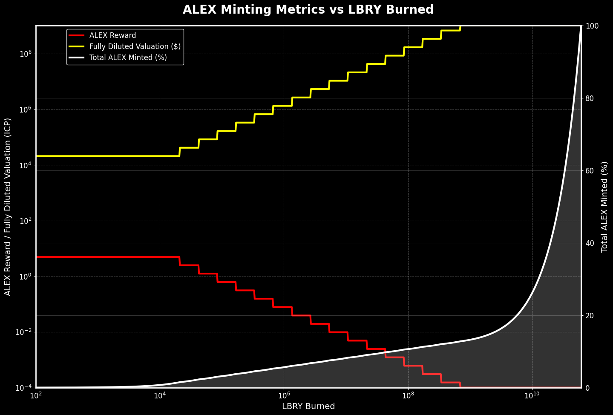
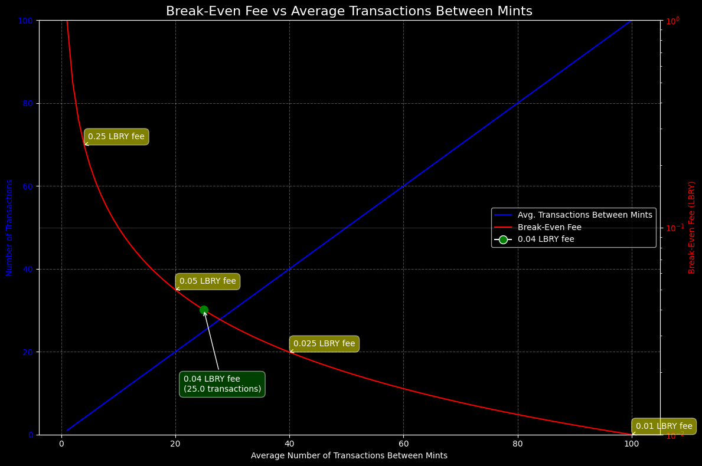

Evan's Monday todo:

NFT STUFF
- Remove metadata from nft minting. Change the minting number to the tx_id of arweave.
    - If decided, remove the mutability attribute.
- Change frontend components to match the new standard.

- Talk to zeeshan about separting the upload and mint process. Right now it's too complex to upload books and mint them in the same transaction. What we should do is have a general minter with all those metadata attributes but have them being optional. Then people can make NFTs of them after they're stored in arweave.

Arsplorer Stuff
- Add more file types.
- Make the file type filters more like checkboxes.
- Make the date sorting nicer, check for accuracy.
- Maybe a load more button. Standardize the query limit/size.
- Display the tags nicer, and allow people to query by tags.
- Add the NFT minting feature.

- Then eventually the SBT stuff, and how these are organized into channels that are forkable/sharable/etc.

# Alexandria WhitePaper

## Table of Contents
- [Introduction](#introduction)
- [Project Overview](#project-overview)
- [Part 1: Network Architecture](#part-1-network-architecture)
  - [Librarians](#librarians)
  - [LibModules](#libmodules)
- [Part 2: Token Economics and Mechanics](#part-2-token-economics-and-mechanics)
  - [LBRY Token](#lbry-token)
  - [ALEX Token](#alex-token)
    - [Minting Process](#minting-process)
    - [Distribution Mechanics](#distribution-mechanics)
    - [Utility](#utility)
- [Part 3: Non-Fungible Tokens Economics And Mechanics](#part-3-non-fungible-tokens-economics-and-mechanics)
  - [NFTs](#nfts)
    - [Ebook NFTs](#ebook-nfts)
    - [Other NFTs](#other-nfts)
  - [SBTs](#sbts)
  - [References](#references)
- [Part 4: Ecosystem](#part-4-ecosystem)
  - [Becoming a Librarian](#becoming-a-librarian)

## Introduction

The Internet has come to rely almost exclusively on Big Tech services as its information aggregators. This tweet summs up the effects from this that we all feel every day:

https://x.com/Noahpinion/status/1818776478315954200

The Static Web1 that was supposed to unlock the worlds information became buried by the Social Web2, sending 95-99% of digital content to the ‘deep web’ where it's inaccessible through conventional means. Today, digital content that isn’t (1) search-engine optimized, (2) open-access, and (3) brand new, is basically forever lost.

This paradigm stems from the Internets' ownership problem. Search engines don’t actually own what they point to, nor social platforms what they display, nor cloud providers what they host. Yet, their survival dpends on leveraging data as their own, blocking others from using it, optimizing for engagement over searchability, and disregarding the rights of creators. 
Web3 is an Internet where everything digital is owned by someone. This has been achieved for money, e.g., Bitcoin; and to some extent for art with NFTs, but nowhere else. It seems everyone has given up the purist vision.

To give true ownership to a peice of content, you basically need to keep the original fixed supply of one while being able to distribute it infinitely. Put simply, you need to recreate the search, social, and hosting elements around making use of that original copy—so that’s what we’re doing.

Alexandria is a library in cypherspace with all its information owned by individuals in the network, much like Bitcoin except for generic content instead of money. This begins with ebooks being owned and used as NFTs, but continues with any file type (video, audio, etc.), used in a suite of Open Internet Services.

Alexandria is not so much about building a 'new Internet', but going backwards with Web3-level tools to that time where Web1 became Web2. It's the place to opt-out for people who think we took the wrong fork in the road.

## Project Overview

Alexandria quite literally strives to be the world's largest public library. At its core, anyone can come in and put a book on the shelf (or movie, song, podcast, etc.) and anyone else can come pick it up.

As a Web3 library though, there are a few differences. Every book is guaranteed to last 'forever', and the upper limit on the number of books is infinity, so you'll likely not want to spend time in the main library, lest you never find what you're looking for.

Alexandria does provide template toolkits for advanced curation from the library's content through which people build apps.

User interaction with Alexandria will often be through apps in the app store, much like library branches. Anyone can build their own branch, doing so with pre-existing tooling and content.

Authorship and creator rights are perfectly preserved since every peice of content in the library is owned. When a book is used with paid features, the payment is sent to and stored in the book itself and remains there until the rightful author/creator comes to claim it.

## Part 1: Network Architecture

Alexandria is the Web3 library we've been talking about. It indexes the entire library, gives you the tools needed to search it, and keeps track of whatever gets borrowed.

### Librarians

Alexandria, a self-contained place in cypherspace, is made navigable by porting open versions of the major 'Web Surfing' tools: Search, Social, Storage and AI. It has Librarians operating autonomous software, not users visiting a platform. 

After signing up with a Internet Identity, Google Auth, Ethereum, Solana, or NFID, each entrant is issued a Principal that identifies them as a Librarian.

### LibModules

Librarians carry the weight of service hosting by deploying pre-configured, open-source packages called 'LibModules'. Technically, they're just nodes that provide pluggable API for developers, starting with the following:

- ArWeave (completed): Uploads Alexandria-compatable books to the permaweb.
- Meilisearch (completed): Creates keyword search engines from the contents of books.
- AI (incomplete): Provides LLMs and other ML models, pluggable for use in partner apps.
- Qdrant (incomplete): Creates vector search engines from the contents of books.
- Bittorrent/IPFS/etc. (incomplete): Indexing existing movie/podcast/music files as part of the Alexandria Library.

(1) Storage-related LibModules use the node keys of Librarians to host on that given blockchain, e.g., Arweave/IPFS.

(2) Compute-related LibModules are simply API keys, agnostic to where the Librarian hosts.

In each case, a Librarian can store the encrypted keys of a LibModule they host, as well as the right for Alexandria Cansiters to decrypt them with VetKeys. In this way, others can pay that Librarian to use the Libmodule without ever exposing their underlying keys to anyone.

Alexandria provides no storage or compute resources for LibModules, but only saves encrypted versions of the keys and performs compatability checks on them. LibModules are otherwise entirely managed and maintained by the ecosystem of Librarians.

The ideal Librarian is someone immersed in the convergence of technology and literature, but the typical one is just trying to make money from the token mechanism.

## Part 2: Token Economics and Mechanics

Alexandria is a dual token economy of two ICRC1 tokens: LBRY as energy and payment; and ALEX for revshare and governance.

LBRY is always mintable with ICP at a 1:1000 ratio, up to an infinite supply; and ALEX is mined when LBRY is burned, up to a hard cap of 21 Million, much like Bitcoin. 

### LBRY Token

LBRY's supply is entirely managed by the "icp_swap" canister which uses the Exchange Rate Canister to keep the mint rate at at 1XDR:1000LBRY, or about 1.3 cents per LBRY. Librarians mint by sending ICP to the canister, and get newly minted tokens to their main wallet.

Librarians have two wallets by default: A 'main' and 'spending' wallet. Use of LibModules pays LBRY to the Librarian that hosts it. Using a paid NFT/SBT feature automatically sends that LBRY to that NFT/SBT wallet. After sending LBRY to the spending wallet, Alexandria can sign microtransactions on your behalf so payment happens in the background. 

Aftermarket LBRY can be spent again on other services or sold on secondary markets, but the key to retaining it's value is a burn mechanism that produces half of its inital purchase value, and mints the next block of ALEX.

### ALEX Token

ALEX mirrors Bitcoin tokenomics. It has an initial supply of zero and a total supply of 21 Million, and it's creation requires burning of LBRY (energy). There is no team, investor, or other hidden allocations.

#### Minting Process

A block is mined when someone sends 1 or more LBRY (whole numbers only) to the burn address. For each burned LBRY, 3 ALEX mints occur, and three parties are rewarded:

    (1) The sender who burned the LBRY is returned ICP at a 0.5:1000 ratio (1/2 the buy price), and one ALEX mint at the current minting rate.

    (2) A recent LBRY sender is rewarded one ALEX mint at the current minting rate.

    (3) A recent LBRY reciever is rewarded one ALEX mint at the current minting rate.

The 'winning' Librarians are the sending and recieving addresses of a randomly selected recent LBRY transaction (random from the last ~100 transactions excluding those to and from the burn/mint address). While this token swapping, burning, and minting logic is kept isolated and immutbable canisters, the method to select the random LBRY transaction is in the main backend cansiter and mutable, so it can adapt to only select for in-app payments and adapt to prevent gaming.

Spliting things this way keeps incentives balanced, i.e., each investment in the token is accompanied with two equal investments in some network contributors. Put another way, every time you use some paid app service, you're elible for an airdrop, and the allocation for airdrops is 100% of the token supply.

#### Distribution Mechanics

Bitcoin launched with a 50 BTC Block Reward that halves every 210,000 blocks. Alexandria uses a similar but flattened modification of that minting schedule: A 5 ALEX Reward, and the halving rate at 21,000. This normalization accounts for the decreased difficulty of burning LBRY when compared to mining Bitcoin Blocks.

BTC blocks are mined at mostly fixed intervals, while ALEX mints increase proportional to network use. The minting mechanism accounts for this by doubling the number of mints for a reward drop after each halving.

The result is a much flatter distirbution that takes ~62 Billion burn actions to emit.

| LBRY Burned      | ALEX Reward | Total ALEX Minted | Fully Diluted Valuation (XDR) |
|------------------|-------------|-------------------|-------------------------------|
| 21,000.00        | 5.0000      | 315,000.00        | $21,000.00                    |
| 42,000.00        | 2.5000      | 472,500.00        | $42,000.00                    |
| 84,000.00        | 1.2500      | 630,000.00        | $84,000.00                    |
| 168,000.00       | 0.6250      | 787,500.00        | $168,000.00                   |
| 336,000.00       | 0.3125      | 945,000.00        | $336,000.00                   |
| 672,000.00       | 0.1562      | 1,102,500.00      | $672,000.00                   |
| 1,344,000.00     | 0.0781      | 1,260,000.00      | $1,344,000.00                 |
| 2,688,000.00     | 0.0391      | 1,417,500.00      | $2,688,000.00                 |
| 5,376,000.00     | 0.0195      | 1,575,000.00      | $5,376,000.00                 |
| 10,752,000.00    | 0.0098      | 1,732,500.00      | $10,752,000.00                |
| 21,504,000.00    | 0.0049      | 1,890,000.00      | $21,504,000.00                |
| 43,008,000.00    | 0.0024      | 2,047,500.00      | $43,008,000.00                |
| 86,016,000.00    | 0.0012      | 2,205,000.00      | $86,016,000.00                |
| 172,032,000.00   | 0.0006      | 2,362,500.00      | $172,032,000.00               |
| 344,064,000.00   | 0.0003      | 2,520,000.00      | $344,064,000.00               |
| 688,128,000.00   | 0.0002      | 2,677,500.00      | $688,128,000.00               |
| 1,376,256,000.00 | 0.0001      | 2,883,938.40      | $1,000,000,000.00             |
| ...              | ...         | ...               | $1,000,000,000.00             |
| 61,763,128,000.00| 0.0001      | 21,000,000.00     | $1,000,000,000.00             |

These numbers were chosen with respect to (1) the BTC mechanism and (2) the anticipated Fully Diluted Valuation at any given point.

FDV is calculated as  21 million / (0.5cents * minting_reward):

For example, for each LBRY you burn during the first reward epoch, you'll loose the 1 cent it's worth but get back 1/2 a cent in ICP, and get one of the three corresponding 5 ALEX mints, i.e., a tenth of a penny per ALEX, which is a $21,000 FDV

From mints 0 to 1 Billion, the FDV is below $1B, but mints ~1 to 62 Billion are all made at the that $1B valuation. This means only ~15% of the supply is up for grabs at <$1B FDV, and 85% thereafter, ensureing there's garenteed and substantial ownership availible to Libriarians at least up until Alexandria reaches 'Unicorn' status.

#### Bots

Since each minting cycle rewards paries of a recent LBRY transaction, the way to game this is a bot that constantly sends LBRY.

The effectiveness of this strategy decreases as a function of (1) the LBRY transaction fee and (2) the number of transactions that occur between mints according to the following table:

LBRY uses a 0.04 universal transaction fee that is burned without reward to combat this.

Let's look at an example. With a 0.04 LBRY fee, it takes 25 transactions to burn 1 LBRY. If one of those is selected, you'll get 2 ALEX mints (assuming you sent those transactions to yourself). At that point though, you could have just burned 2 LBRY to get the mints, and you'd also get the value of 1 LBRY back in ICP.

In short, if there are 25+ LBRY total LBRY transactions between mints, than this strategy is not effective.

Still, during times of more minting than transacting, this strategy is welcomed, as it has it's own checks and balances while burning mass amounts of LBRY, which ultimately returns value in ICP to stakers.

LBRY burning returns half its initial XDR value so that even if the ALEX mint is not valuable enough to incentivize people to burn it, it eventually has to be burned to get that ICP back. This combined with the 0.05 LBRY transfer fee will balance secondary markets such that fresh LBRY will always need to be minted and burned.

LBRY is designed to return half the minting value in XDR. This fact plus fee ensures that secondary market trading is not a replacement for the mint and burn mechanism. Even if all ALEX is minted, use of the platform will necessitate LBRY minting and burning, and thus platform revenue.

#### Utility

All the ICP used to mint LBRY is stored in the staking pool. 10% of the total ICP accrued in the staking pool is emmited to stakers proportionally every 24 hours (minus an small allocation used to top up canisters).

Staked ALEX is also used for DAO voting via our governance mechanism, but voting is completely optional and carries no reward or penalty.

There's no utility other than voting. There's no value other than staking revshare.

## Part 3: Non-Fungible Tokens Economics And Mechanics

In Alexandria, everything you see is owned by someone in some way. This ownership is of three forms: 

(1) Non-Fungible Token (NFT) - Owned files that can be transfered.
(2) Soul-Bount Token (SBT) - Owned content fragments that cannot be transfered.
(3) Reference - A secondary copy of an SBT or NFT that cannot be transferred.

## NFTs

Alexandria NFTs aim to encompass all content types, starting with ebooks, and eventually, videos, songs, podcasts, etc.

Since Ebooks are generally attributable to a single person and of a managable file size, the ability to use and mint them is already finallized in-app.

The solution for more generic file types will likey use the same single "Alexandria NFT" collection, but have different metadata and hosting locations that are to be determined.

### Ebook NFTs

Alexandria NFTs use a Motoko implementation of the ICRC7 and ICRC37 standards, with default transfer, mint, burn, etc., functionality. There is no supply cap, and anyone can mint an NFT at an availible mint#, which starts at 1 and increases consecutively.

The minting uses the ArWeave LibModule, where Librarians host a pre-paid node that can upload files to the permaweb.

The cost to mint is an estimated 1 LBRY + 5LBRY/MB at a $10 ICP (1LBRY=1cent at $10 ICP). It costs Librarians $0.027/MB, so this is a breakeven price plus free ALEX mints for Librarians if they were to burn the LBRY, or a 2X margin at the LBRY purchase price.

Let's look at an example. You are a Librarian with some LBRY and seek to mint a 10MB version of "The Bible" as the first NFT on Alexandria. After clicking "Mint NFT" on the manager page, you select the ArWeave Node of the Librarian you wish to use, upload the book, and populate/check some manual/autogenerated fields:

    Files: [.epub file]
    Cover: [image uploaded by the minter]

    tx_id: nYIQwN_-EjFdmNCBSrfkD9E6-Sgixl8a0Zu3sj1gltQ
    Title: The Bible
    Author: God
    Content-Type: application/epub+zip
    application-id: Alexandria
    minting_number: 1
    fiction: false
    language: en
    author_first: I
    author_last: AM
    type: 2
    type0: 0
    type1: 0
    type2: 1
    type3: 0
    type4: 1
    type5: 0
    type6: 0
    type7: 1
    type8: 0
    type9: 0
    era: 1

If the human readable version in the UI checks out, you submit to pay 51 LBRY and mint. That LBRY is sent to the chosen Librarian, their node upserts all this data to ArWeave, and then our backend mints the ICRC7 NFT with the following fields:

    mint#: 1
    tx_id: nYIQwN_-EjFdmNCBSrfkD9E6-Sgixl8a0Zu3sj1gltQ
    owner: 2jgt7-v33z4-tiosh-csi2v-66cge-4uu7j-v2nye-z27vc-d36pc-ctqai-bqe
    collected_lbry: 0
    collected_alex: 0
    verified: false

The first set of fields is immutably stored on ArWeave. 

Of the second set of feilds, the mint# and tx_id are immutably stored on ICP and map to the ArWeave data, while owner, collected_lbry, and verified are mutably stored on ICP to give Alexandria NFTs certain special features.

Alexandria employs an "nft_manager" canister to handle mutable metadata. It has several functions:

    (1) Manage NFT Wallets.
    (2) Change an NFT's 'verified' field from false to true if requested by the DAO.
    (3) Transfer an unverified NFT to its rightful owner if requested by the DAO.

Let's continue with our example. After you minted "The Bible" as the first Alexandria NFT, others can now pay LBRY to use it in the various ways we'll soon see.

LBRY paid use of this NFT #1 is put in subaccount "000...1" of the nft_manager canister. Since it's recieving LBRY payments, it's also eligable to recieve ALEX mints to that same account. In order for you, the owner, to claim this money, you must first verify yourself as a rightful owner by sumbiting a proposal to the DAO. Assuming the version of "The Bible" is Open Domain, you're able to use it as your own and the DAO will likey approve it, which instructs the nft_manager canister to change the verified field to 'true', at which point you can claim all rewards and no-one can ever reverse that NFT ownership.

Assuming you uploaded the latest James Patterson novel and went through the same steps, this would fail, and you'd not be able to gain any profit from the book. Rather, all the profit accrued from it's use will be 'stuck' there until James Patterson comes on the site and submits a DAO proposal, at which point, the nft_manager canister will transfer it to him and verify it so all funds can be claimed, and the book can be removed (burned) if he likes.

### Other NFTs

Replicating this process for things like video and audio is more complicated because (1) file size is much bigger and would be quite expensive on ArWeave and (2) they often have many contributors and so how to split rewards has not been figured out.

Alexandria will start with ebooks, and then adapt the DAO and storage methods to accomodate more file types under the same collection.

### SBTs

Alexandria SBTs are much more versatilile since they do not require any standardized format. The upload is also 1LBRY + 5ICP/mb, and the only metadata is an ICP Principal. Examples that would be saved this way are a bookmarked snippets of an ebook, an in-site blog, a whiteboard made of other SBTs, etc.

All content on Alexandria Apps is an SBT. The purpose of this is simple: So you are paid when others use your work. If you'd like to save someone's SBT to your library, you'll pay the owner a small fee to make a reference.

### References

References are just saves of SBTs that allow you to use them as part of your own profile. In Alexandria you pay fractions of a penny in the background to bookmark, like and save the posts of others. These posts are saved in your own records and readily usable as a consequence.

It is the pinnacle of the sharing economy, akin to an Internet where the creator gets a kickback every time their content is liked or shared.

## Part 4: Ecosystem

Alexandria apps are services already plugged into LibModules. Since LibModule functions can only be accessed with the proper LBRY payment, all partner apps are also aligned with our universal DeFi mechanism.

As a Librarian, the lbry.app homepage will feel more like an app store than a Web3 tech stack. The apps registry consists of core apps native to the site, or external sites that have been approved by the DAO.

The following is a list of core apps in the works.

### Bibliotheca (library)

A simple kindle clone where everyone can read any books they like for free.

Special features:
  - Save fragments (text snippets) as SBTs.
  - Download books for a fee.
  - Full text search on any book while reading.
  - Cataloging of books you've read, are currently reading, and wish to read.
  - Share reviews, book fragments, and comments with other readers.

It's GoodReads meets Kindle with an economy inside.

### Syllogos (aggregate)

A app of custom search engines. Search through thousands of books with AI or keywords. If there's not one that fits your needs, make your own by clicking books you'd like to add to a new search engine. Save any results you might want to use later as SBTs.

These search engines are a modular and sometimes paid feature. Make a popular search engine, get paid for it as it gets integrated and used across other Alexandria apps.

It's Google, but the search engines are customized and actually designed to find information.

### Perpetua (write)

A blog-based app based around SBTs. All the text fragments you and others have collected here are used to create blogs and whiteboards that are attached to their primary sources.

In addition to conventional blogs, Syllogos replicates the viral Iceberg format where a topic is broken into interactive layers of increasing obscurity. Instead of a blog of text, this is a chart decorated with topic fragments, each linking to a primary source in a book that expresses a point about some topic.

Syllogos will employ various AI related LibModules to 'decorate' SBTs with titles, summaries, emojis indicating sentiment, badges indicating authenticity, and ratings from user feedback.

It's a place where golden nuggets are lifted from a sea of endless pages and brought to life, as if a trading card or other in-game collectable. It's Medium meets IcebergCharts.org, except hyperlinks to external sites are replaced with app-native components.

### Dialectica (debate)

A character-based AI app where users can train an AI on a set of NFTs and SBTs so they can speak on behalf of that author or topic by referencing the primary sources of their training data.

AIs of different specializations can debate eachother with users steering the conversations and ultimately evolving to consensus on which one is correct.

### Permasearch (explore)

A 3d exploration game of the literal library Alexandria where the goal is to get a bachelors degree using only a library card.

There are 100 rooms in the library, each dedicated to a category where they player needs to recruit the help of librarians to find in-book references to certain events and concepts.

For the more casual user, it's a metaverse where you can find things to read like you would in a real library.

### Emporium (trade)

An NFT marketplace for all Alexandria NFTs.

NFTs are valued on a few displayed attributes. First is the mint#, early ones having a certain novelty, but there's also the accrued LBRY and ALEX over its lifetime and whether or not the NFT is verified. Since NFTs are money making assets, and also have money saved inside them, trades are about more than aquiring collectables.

Emporium will empoloy a 5% trading royalty, all of which goes to the staking pool.

### Beyond Books

The following are simple app ideas with the current content type that is books.

As the library comes to include movies, songs, podcasts, and videos at potentially infinite scale, anyone will be able to make the decentralized Netflix, Spotify, YouTube, etc., with an existing content base.

The reason such apps are untouchable right now is because they're powered by data monopolies, but if we move all that data to a shared permaweb, than everyday devs have access to the same content scale as Big Tech through Alexandria.

## Part 5: Architecture & Governance

D-app ecosystem - Anything you can imagine.
  - The point is along the way we make these services that power apps, easily pluggable.
  - In this way the LibModule is built already for you, with a nice economic model that just works out of the box.
  - Of course people could fork this, and go do their own version, but in doing so they'll circumvent the economic model, loose network effects, and have to start from scratch in making their own building blocks.

- Governance (GOVERNANCE SECTION) SNS Deployment.
  - Initially it will just determine who owns what NFT.
  - The development will remain admittedly centralized, based on sheer complexity.
    - Things can go wrong, forks can occur, etc.
    - But the token stuff will be fair, blackholed, and rightfully forkable (decentralized).
  - SNS launch or fork are possibilies, but it's unclear what aditional canisters will be handed to the DAO, blackholed, or otherwise stay under centralized management.
    - The road to decentralization is paved with hypocracy. At least I'm being honest about it.

- Team earnings.
  - Earning of default librarian providers go to a wallet to pay the team, but it's totally optional and people can change their libmodule providers to whoever.

### Governance

UncensensoredGreats is currently a centrally developed and deployed project. It depends on an architecture of tentatively ‘blackholed’ canisters, so the renounching storage and token related smart contract over time. It is fully open-source, so the current state of decentralizion can be tracked on [Github](https://github.com/UncensoredGreats/).

The frontend will be continuously developed, and so use of backend functions from blackholed canisters will remain mutable indefinitely. Nonetheless, anyone can fork the project with an alternative frontend that’s bound by the same code and data of Alexandria’ universal backend canisters.

Since this model prioritizes immutability for the sake of permanence, governance is initially limited to matters involving NFT ownership. The governance mechanism allow proposals that can delete NFTs (if corrupted/inaccurate), or transfer the ownership (to any true author that claim it) with a simple majority and quorum of staked ALEX holders.

I honestly don't know how code changes will be governed in the future. It has not been figured out yet. The important thing is this gets to a working product where the immutable part is entirely forkable so anyone can build their own products independent of parts that are still under centralized developement.

This section will have lots more details at a future time.

### Canister Architecture

ALEX: Token canister (backholed)

alex_backend: Main logic backend.

bookmarks: Main storage backend.

icp_swap: LBRY management canister for swapping and staking tokens.

icrc7: NFT canister.

LBRY: Token canister (blackholed)

Tokenomics: Logic controlling ALEX minting.

DAO Canister: TBD.

## Internet of Books

Alexandria is a universal content bed for the Internet. 

It's like bittorrent and IPFS, except all the content is owned and incentivized.

It's like Facebook and Google, except anyone can plug into and use it.

It's the entire dream of Web3, in one project. What will you do with it?

